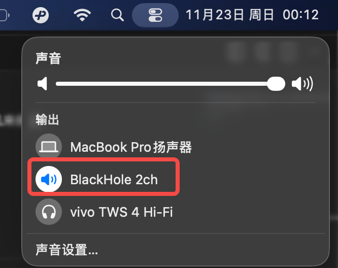
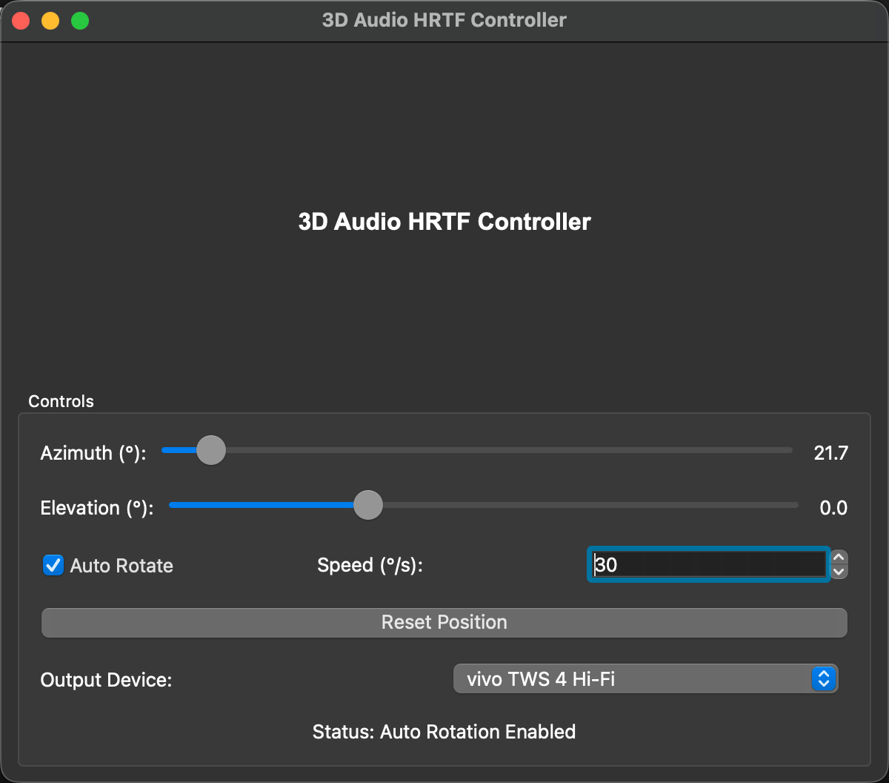

 # Why I Made This

While listening to audiobooks, I found myself getting drowsy. Since I'd been researching spatial audio recently, I created a spatial audio-like effect. Because it uses a human ear model, it's best experienced with headphones.

Then while listening to YouTube ASMR, I discovered that adding this made it even more immersive and tingly. For certain unusual videos, the effect is probably quite remarkable...

# Usage

1. Install BlackHole 2CH and set the default audio output device to BlackHole 2CH
```
brew install --cask blackhole-2ch
```


2. Download main.bin, run it and enable Auto Rotate, or select a different output device


// todo
3. YouTube 3D ASMR effect demonstration

# How It Works

1. Use BlackHole to capture system audio output, then synthesize spatial audio through HRTF (Head-Related Transfer Function), and finally send it to the speakers